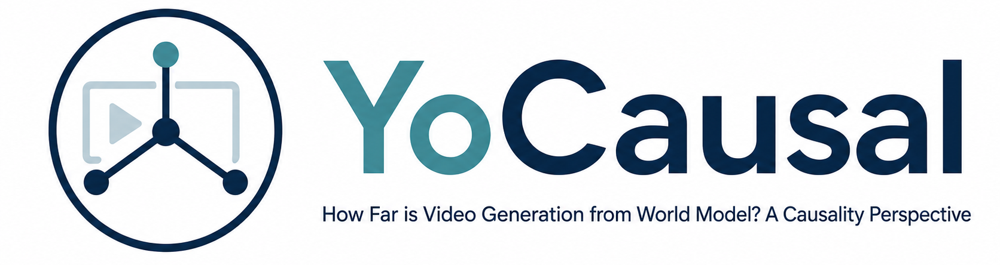

<p align="center">
  
</p>

# YoCausal

**How Far is Video Generation from World Model? A Causality Perspective**

<p align="center">
  <a href="https://www.youzhexie.me/">You-Zhe Xie</a><sup>🦊🌐*</sup>,
  <a href="https://www.yhlizzz.com/">Yu-Hsuan Li</a><sup>🦊*</sup>,
  <a href="https://jayinnn.dev/">Jie-Ying Lee</a><sup>🦊</sup>,
  <a href="https://kpzhang93.github.io/">Kaipeng Zhang</a><sup>🌐</sup>,<br>
  <a href="https://yulunalexliu.github.io/">Yu-Lun Liu</a><sup>🦊&dagger;</sup>,
  <a href="https://lightchaserx.github.io/">Zhixiang Wang</a><sup>🌐&dagger;</sup>
</p>
<p align="center">
  🦊 National Yang Ming Chiao Tung University &nbsp;&nbsp; 🌐 Shanda AI Research Tokyo<br>
  <sup>*</sup> Equal contribution &nbsp;&nbsp; <sup>&dagger;</sup> Corresponding authors
</p>

[](https://www.youzhexie.me/papers/YoCausal/index.html)
[](https://arxiv.org/abs/2605.30346)
[](https://huggingface.co/datasets/YouZhe/YoCausal-dataset)
[](https://github.com/youzhe0305/YoCausal)
[](#leaderboard-submission)
[](mailto:youzhe0305.cs12@nycu.edu.tw)

YoCausal is an evaluation benchmark that assesses whether video diffusion models understand temporal causality by comparing their denoising loss on forward (natural) vs. backward (time-reversed) videos. A model with genuine causal understanding should assign lower loss to forward videos, since reversed videos violate cause-and-effect relationships.

## Key Idea

Given a video pair — one playing forward and one reversed — we measure the model's denoising loss on each. The **Reverse Surprise Index (RSI)** captures how often the model "prefers" the forward direction, while the **Causality Cognition Index (CCI)** isolates true causal understanding from mere temporal direction awareness by comparing performance on causally-structured vs. non-causal video subsets.

## Outline

- [Project Structure](#project-structure)
- [Metrics](#metrics)
- [Quick Start](#quick-start)
  - [Implement Your Model Evaluator](#1-implement-your-model-evaluator)
  - [Run Evaluation](#2-run-evaluation)
  - [Resume from Checkpoint](#3-resume-from-checkpoint)
- [Datasets](#datasets)
- [VLM Causality Labeling](#vlm-causality-labeling)
- [Wan Model Evaluation (DiffSynth-Studio)](#wan-model-evaluation-diffsynth-studio)
- [Important Implementation Details](#important-implementation-details)
- [Output Format](#output-format)
- [Leaderboard Submission](#leaderboard-submission)
  - [Result Submission](#result-submission)
  - [Model Submission](#model-submission)
- [Requirements](#requirements)
- [Citation](#citation)

## Project Structure

```
YoCausal/
├── evaluation/                   # Core evaluation framework
│   ├── base_evaluator.py         # Abstract base class (implement this for your model)
│   ├── evaluate.py               # Main evaluation script (loss → RSI/CCI → JSON)
│   ├── metrics.py                # RSI / CCI computation
│   ├── example_animatediff_evaluator.py  # Reference implementation template
│   └── README.md                 # Detailed evaluation protocol docs
│
├── VLM_labeling/                 # VLM-based causality annotation
│   ├── prompt.txt                # Prompt template for causality classification
│   └── gemini/
│       └── gemini_video_query.py # Batch video querying via Gemini API
│
└── DiffSynth-Studio/            # Modified DiffSynth-Studio for Wan model evaluation
    ├── diffsynth/                # Core library (models, pipelines, schedulers)
    └── examples/wanvideo/        # Loss comparison scripts for Wan model family
```

## Metrics

| Metric | Formula | Description |
|--------|---------|-------------|
| **RSI** | Mean of per-dataset forward win rates | Overall temporal direction sensitivity. RSI = 50% means random guessing. |
| **RSI(Dc)** | RSI on causal subset | Win rate on videos with causal relationships |
| **RSI(Dnc)** | RSI on non-causal subset | Win rate on videos without causal relationships |
| **CCI** | RSI(Dc) - RSI(Dnc) | Isolates causal understanding from temporal awareness. Higher is better. |
| **RSI(Hd)** | RSI on human-discriminable subset | Win rate on videos humans can tell apart |
| **RSI(Hnd)** | RSI on human-non-discriminable subset | Win rate on videos humans cannot tell apart |

## Quick Start

### 1. Implement Your Model Evaluator

Subclass `BaseVideoEvaluator` and implement 4 methods:

```python
from evaluation.base_evaluator import BaseVideoEvaluator

class MyModelEvaluator(BaseVideoEvaluator):
    def __init__(self, model_dir, device="cuda"):
        # Load model weights (VAE, UNet/DiT, Text Encoder, Scheduler, etc.)
        ...

    def get_model_info(self) -> dict:
        return {"model_name": "MyModel", "parameters": 1_000_000_000}

    def get_eval_settings(self) -> dict:
        return {"fps": 16, "resolution": [480, 720], "window_size": 49}

    def get_timesteps(self) -> list:
        # K=10 uniformly sampled timesteps (excluding boundaries)
        return [90, 181, 272, 363, 454, 544, 635, 726, 817, 908]

    def compute_video_loss(self, video_path, prompt, timestep, noise_seed):
        # 1. Load and preprocess video (FPS, resolution, cropping)
        # 2. Encode prompt
        # 3. VAE encode -> latents
        # 4. Set random seed to noise_seed
        # 5. At specified timestep: add noise -> model prediction -> MSE loss
        # 6. Return loss (float)
        ...
```

See `evaluation/example_animatediff_evaluator.py` for a complete reference template.

### 2. Run Evaluation

**Command-line:**

```bash
python evaluation/evaluate.py \
    --evaluator_module my_evaluator \
    --evaluator_class MyModelEvaluator \
    --evaluator_args '{"model_dir": "/path/to/weights", "device": "cuda"}' \
    --dataset_paths \
        /path/to/YoCausal-dataset/subset/animal/dataset_metadata.json \
        /path/to/YoCausal-dataset/subset/general/dataset_metadata.json \
        /path/to/YoCausal-dataset/subset/human/dataset_metadata.json \
        /path/to/YoCausal-dataset/subset/physics/dataset_metadata.json \
    --dataset_base_path /path/to/YoCausal-dataset/subset \
    --output results/my_model_result.json
```

**Programmatic:**

```python
from evaluation.evaluate import run_evaluation
from my_evaluator import MyModelEvaluator

evaluator = MyModelEvaluator(model_dir="weights/", device="cuda")
results = run_evaluation(
    evaluator=evaluator,
    dataset_paths=["/path/to/YoCausal-dataset/subset/animal/dataset_metadata.json", ...],
    dataset_base_path="/path/to/YoCausal-dataset/subset",
    output_path="results/my_model_result.json",
)
```

### 3. Resume from Checkpoint

If evaluation is interrupted, resume from the auto-saved checkpoint:

```bash
python evaluation/evaluate.py \
    --evaluator_module my_evaluator \
    --evaluator_class MyModelEvaluator \
    --resume results/my_model_result.json.checkpoint \
    --output results/my_model_result.json \
    ...
```

## Datasets

The released YoCausal dataset is hosted on [Hugging Face](https://huggingface.co/datasets/YouZhe/YoCausal-dataset).

The benchmark uses four video datasets spanning different domains:

| Dataset | Domain | Description |
|---------|--------|-------------|
| **Animal Kingdom** | Nature / Biology | Animal behaviors with temporal structure |
| **MIT Moments in Time** | Everyday actions | Diverse human activities and events |
| **Tiny Kinetics-400** | Human actions | Subset of Kinetics-400 action recognition |
| **Physics-IQ** | Physical phenomena | Videos exhibiting physical causality |

Each dataset entry in `dataset_metadata.json` contains:

| Field | Description |
|-------|-------------|
| `id` | Video ID |
| `video_path_forward` | Path to forward (natural) video |
| `video_path_backward` | Path to backward (time-reversed) video |
| `prompt` | Text description of the forward video |
| `dataset_source` | Source dataset name |
| `category` | Video category |
| `meta` | `{fps, resolution, total_frames}` |
| `vlm_causality` | Whether the video has causal relationships (bool, VLM-annotated) |
| `human_discriminable` | Whether humans can distinguish forward from backward (bool) |

## VLM Causality Labeling

The `VLM_labeling/` module uses a vision-language model (Gemini) to annotate each video with a binary causality label. This determines whether a video contains observable cause-and-effect dynamics (e.g., a ball hitting pins vs. clouds drifting).

```bash
# Annotate a dataset
python VLM_labeling/gemini/gemini_video_query.py \
    --dataset-root /path/to/YoCausal-dataset/subset \
    --dataset animal-kingdom \
    --direction fwd \
    --output results/animal-kingdom_fwd.json
```

The released dataset already includes annotation fields in each `dataset_metadata.json`; this command is for producing new VLM annotation outputs.

## Wan Model Evaluation (DiffSynth-Studio)

For evaluating Wan-series video diffusion models (Wan2.1, Wan2.2), we provide standalone scripts that directly compute forward/backward denoising losses using the DiffSynth-Studio pipeline. These scripts handle model-specific details like bucket resolution selection, sliding window processing, and dual-DiT architecture support.

See [`DiffSynth-Studio/examples/wanvideo/README.md`](DiffSynth-Studio/examples/wanvideo/README.md) for details.

Supported models:
- Wan2.1-T2V-1.3B
- Wan2.1-T2V-14B
- Wan2.2-TI2V-5B (T2V mode)
- Wan2.2-T2V-A14B (dual DiT)

## Important Implementation Details

1. **Same noise**: Forward and backward videos use the same `noise_seed` to ensure fair comparison.
2. **Same prompt**: Both directions use the forward video's caption.
3. **K=10 timesteps**: Uniformly sampled timesteps excluding boundaries, as recommended.
4. **Windowing**: Long videos are sliced into windows; context frames from previous windows are excluded from loss computation.
5. **VAE uses mean**: VAE encoding uses the mean of the latent distribution (not a random sample) for reproducibility.

## Output Format

The evaluation produces a JSON file with the following structure:

```json
{
  "model_info": { "model_name": "...", "parameters": 1000000000 },
  "eval_settings": { "fps": 16, "resolution": [480, 720], "window_size": 49, "timesteps_sampled": [...] },
  "per_dataset_metrics": {
    "animal": { "rsi": 0.555, "rsi_dc": 0.60, "rsi_dnc": 0.50, "cci": 0.10, ... },
    "kinetics": { ... },
    "mit": { ... },
    "physics": { ... }
  },
  "overall_metrics": { "rsi": 0.52, "cci": 0.11, ... },
  "per_video_results": [ ... ]
}
```

## Leaderboard Submission

We support two submission protocols for the YoCausal leaderboard. In both cases, please submit by email to [youzhe0305.cs12@nycu.edu.tw](mailto:youzhe0305.cs12@nycu.edu.tw). For updates to the protocol, use the latest instructions on the [YoCausal GitHub repository](https://github.com/youzhe0305/YoCausal).

### Result Submission

Use this protocol if you run YoCausal evaluation on your side. Please attach your resulting JSON file(s) directly to the email.

Please include the following information:

- Email subject: `[YoCausal Leaderboard][Result Submission] <Model Name>`
- Model name and version/checkpoint identifier
- Model size or parameter count, if available
- Attached evaluation result JSON file(s)
- Any changes from the default evaluation settings or preprocessing protocol
- Name and affiliation to display on the leaderboard, if applicable

We may contact you if the JSON files are incomplete, cannot be parsed, or require clarification before being added to the leaderboard.

### Model Submission

Use this protocol if you would like us to run the evaluation for you. Upload the required materials to Google Drive and include the share link in your email.

Your Google Drive folder should include:

- Model weights or instructions for securely accessing the weights
- Inference/evaluation code needed to load and run the model
- Environment setup instructions, such as `requirements.txt`, a Conda environment file, or a Docker specification
- A short command or README explaining how to run inference/evaluation
- Any model-specific preprocessing, prompting, resolution, FPS, or memory requirements

Please ensure that the Google Drive link permits us to view and download the submitted files, either by sharing it with `youzhe0305.cs12@nycu.edu.tw` or by enabling access for anyone with the link.

Please include the following information in the email:

- Email subject: `[YoCausal Leaderboard][Model Submission] <Model Name>`
- Google Drive link
- Model name, version, and parameter count, if available
- Expected hardware/runtime requirements, if known
- Name and affiliation to display on the leaderboard, if applicable

Submitted materials will be used to run the YoCausal evaluation for leaderboard reporting. Please only share weights and code that you are authorized to provide for this purpose.

## Requirements

- Python 3.10+
- PyTorch 2.0+
- ffmpeg (for video loading and FPS resampling)
- Model-specific dependencies (diffusers, transformers, etc.)
- For VLM labeling: `google-genai`, `python-dotenv`

## Citation

```bibtex
@article{xie2026yocausal,
  title   = {YoCausal: How Far is Video Generation from World Model? A Causality Perspective},
  author  = {Xie, You-Zhe and Li, Yu-Hsuan and Lee, Jie-Ying and Zhang, Kaipeng and Liu, Yu-Lun and Wang, Zhixiang},
  journal = {arXiv preprint arXiv:2605.30346},
  year    = {2026}
}
```